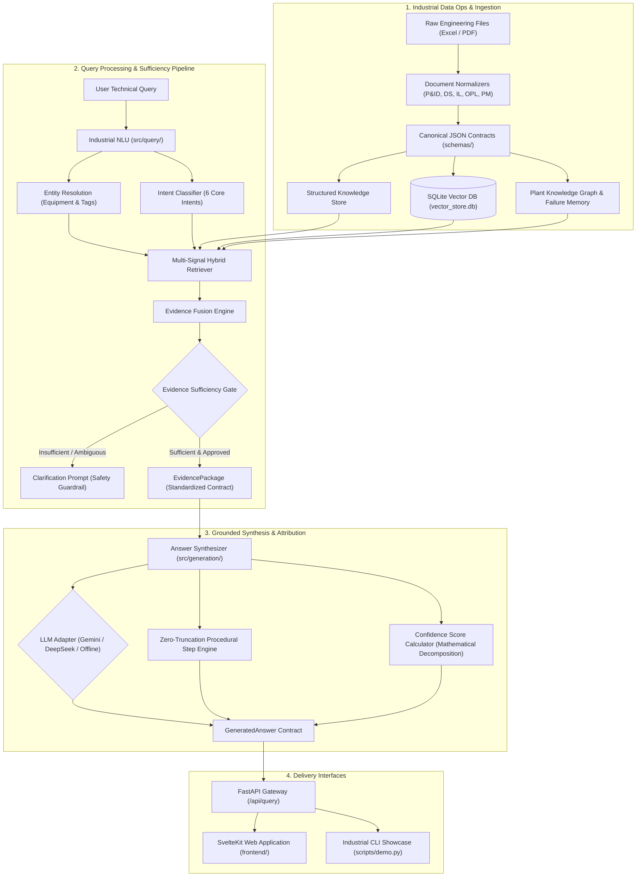
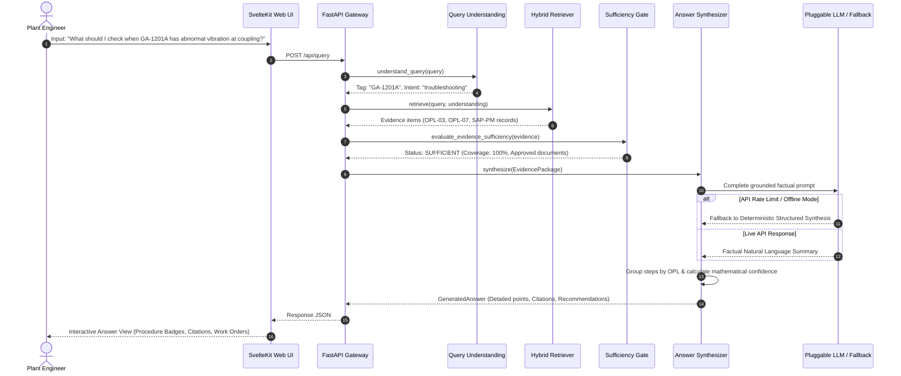
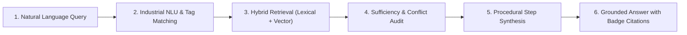

# Chandra Asri Pacific — Manufacturing Knowledge Hub
**CALIBER 2026 Competition — Case 1: AI-Powered Industrial Knowledge Integration**

[](https://www.python.org/downloads/)
[](https://fastapi.tiangolo.com)
[](https://svelte.dev)
[]()
[]()

Platform integrasi pengetahuan operasional pabrik petrokimia yang menghubungkan **SOP, P&ID, Datasheet Teknis, Interlock Cause & Effect Matrix, One-Point Lessons (OPL), serta Riwayat Pemeliharaan SAP PM** menjadi satu kesatuan *evidence-grounded AI knowledge hub*. Sistem ini dirancang anti-halusinasi (*zero unverified extrapolation*), dapat diaudit hingga nomor halaman dan revisi dokumen, serta siap diintegrasikan dengan sistem DCS/EDMS/AIMS dan Digital Twin.

---

## Daftar Isi
1. [Latar Belakang & Solusi CALIBER 2026](#latar-belakang--solusi-caliber-2026)
2. [Arsitektur Sistem (System Architecture)](#arsitektur-sistem-system-architecture)
3. [Diagram Arsitektur Sistem](#diagram-arsitektur-sistem)
4. [Alur Pipeline Kueri (Query Pipeline Lifecycle)](#alur-pipeline-kueri-query-pipeline-lifecycle)
5. [Fitur & Keunggulan Utama](#fitur--keunggulan-utama)
6. [Audit Matematika Skor Kepercayaan (Confidence Scoring)](#audit-matematika-skor-kepercayaan-confidence-scoring)
7. [Dokumentasi API & Endpoint](#dokumentasi-api--endpoint)
8. [Panduan Instalasi & Menjalankan Sistem](#panduan-instalasi--menjalankan-sistem)
9. [Automated Test Suite & Adversarial Benchmarks](#automated-test-suite--adversarial-benchmarks)
10. [Struktur Repositori](#struktur-repositori)

---

## Latar Belakang & Solusi CALIBER 2026

Di industri petrokimia (*continuous process plant*), pengetahuan teknis pabrik sering kali terfragmentasi di berbagai silo dokumen:
* **Datasheet Peralatan**: Berisi batasan desain mekanikal & termal yang statis.
* **P&ID (Piping & Instrumentation Diagram)**: Konfigurasi perpipaan, batas baterai, dan instrumentasi *as-built*.
* **Interlock Cause & Effect**: Matriks proteksi keselamatan instrumen (*SIS/ESD, trip setpoints, start permissives*).
* **SOP & OPL (One-Point Lesson)**: Prosedur operasional lapangan dan keahlian praktisi (*tacit knowledge*).
* **SAP PM (Plant Maintenance Log)**: Riwayat kegagalan nyata, *root cause analysis* (RCA), dan tindakan perbaikan masa lalu.

**Risiko di Lapangan:** Ketika terjadi anomali (misalnya vibrasi tinggi pada pompa atau kenaikan suhu reboiler), teknisi dan operator membutuhkan waktu lama untuk menyilangkan informasi antar dokumen. Kesalahan interpretasi atau ketergantungan pada asumsi dapat memicu *unplanned plant shutdown*, kerusakan fatal aset, maupun *safety hazard*.

**Solusi Kami:** **Manufacturing Knowledge Hub** menghadirkan fondasi **Industrial Data Ops** yang menstandarisasi seluruh modalitas dokumen ke dalam *Canonical Pydantic Data Contracts*, membangun **Plant Knowledge Graph** relasional, dan mengorkestrasikan **Multi-Signal Hybrid Retrieval Engine** dengan jaminan **Evidence Sufficiency Gate** sebelum jawaban disintesis oleh LLM.

---

## Arsitektur Sistem (System Architecture)

Sistem dirancang dengan arsitektur berlapis yang ter-decouple (*clean decoupled architecture*):

```
┌─────────────────────────────────────────────────────────────────────────┐
│               PRESENTATION LAYER (Web UI & Industrial CLI)              │
│       SvelteKit 5 + Tailwind CSS (Web UI)  │  Terminal CLI Showcase     │
└────────────────────────────────────▲────────────────────────────────────┘
                                     │ HTTP REST / JSON
┌────────────────────────────────────▼────────────────────────────────────┐
│                    API GATEWAY (FastAPI Application)                    │
│      /api/query  │  /api/failure-memory/*  │  /api/graph/*  │  /health  │
└────────────────────────────────────▲────────────────────────────────────┘
                                     │
┌────────────────────────────────────┴────────────────────────────────────┐
│                    KNOWLEDGE ORCHESTRATION PIPELINE                     │
│                                                                         │
│  [1. Query Understanding]  ──► [2. Hybrid Retrieval Engine]             │
│   • Regex & Token Entity Res.   • Lexical Search (BM25 / Exact Match)   │
│   • Hybrid Intent Classifier    • SQLite Vector DB (Dense Embeddings)   │
│                                 • Dynamic Metadata Filtering            │
│                                                │                        │
│                                                ▼                        │
│  [4. Answer Synthesis & Grounding] ◄── [3. Evidence Sufficiency Gate]   │
│   • Pluggable LLM (Gemini/DeepSeek)• Provenance & Approval Check        │
│   • Zero-Truncation Step Engine • Obsolescence & Conflict Penalty       │
│   • Mathematical Confidence Calc• EvidencePackage Fusion                │
└────────────────────────────────────▲────────────────────────────────────┘
                                     │
┌────────────────────────────────────┴────────────────────────────────────┐
│              DATA STORAGE, GRAPH & FAILURE MEMORY LAYER                 │
│  • Canonical Structured Store (Datasheets, Interlocks, P&ID registers)  │
│  • In-Process SQLite Vector DB (TfidfDenseEmbedder, 900+ vectors)       │
│  • Plant Knowledge Graph (BFS Multi-Hop Failure Path Propagation)       │
│  • Active Failure Memory Engine (Symptom Matching & SAP PM RCA Records) │
└─────────────────────────────────────────────────────────────────────────┘
```

### Rincian 6 Lapisan Arsitektur:

1. **Ingestion & Data Normalization Layer ([`src/ingestion/`](src/ingestion/)):**
   * Mengubah file Excel mentah dan PDF menjadi dokumen terstruktur JSON berskema baku ([`schemas/`](schemas/)).
   * Memvalidasi *document approval status* (`Issued for Operation`, `Approved`, `Issued for Construction`).
2. **Plant Knowledge Graph & Failure Memory Layer ([`src/graph/`](src/graph/), [`src/failure_memory/`](src/failure_memory/)):**
   * Memetakan topologi fisik pabrik: `Plant -> Area -> Unit -> Equipment -> Instrument`.
   * Menghubungkan jalur propagasi anomali *multi-hop* (misalnya: *lube oil pressure low $\rightarrow$ bearing friction $\rightarrow$ high vibration trip*).
   * Mesin memori kegagalan melacak frekuensi kerusakan dan mencocokkan gejala saat ini dengan *SAP Work Order* historis.
3. **Query Understanding & Industrial NLU ([`src/query/`](src/query/)):**
   * Resolusi entitas presisi tinggi untuk *equipment tags* (misal: `GA-1201A`, `FA-8901`, `EA-5601`) dan instrumen (`PSLL-1201`, `VSHH-1201`).
   * Klasifikasi intensi teknis multi-kategori: `equipment_information`, `protection`, `troubleshooting`, `failure_history`, `operating_limits`, `conflict_check`.
4. **Multi-Signal Hybrid Retrieval Engine ([`src/retrieval/`](src/retrieval/)):**
   * Menggabungkan pencarian leksikal kata kunci eksak (BM25), pencarian kemiripan subkata/karakter, filter metadata ketat, dan pencarian vektor kosinus pada *in-process SQLite Vector Store*.
5. **Evidence Sufficiency Gate & Conflict Detector ([`src/retrieval/sufficiency.py`](src/retrieval/sufficiency.py)):**
   * Mengaudit apakah dokumen yang ditemukan cukup untuk menjawab pertanyaan secara aman.
   * Mendeteksi jika terdapat konflik nilai desain antar revisi dokumen sebelum dikirim ke LLM.
6. **Grounded Generation & Citation Attribution ([`src/generation/`](src/generation/)):**
   * LLM adapter fleksibel (Google Gemini 3.8 Flash, DeepSeek, OpenAI) dengan *deterministic fallback* jika kuota API habis atau offline.
   * Generator sekuensial OPL yang menjamin **seluruh langkah prosedur tampil tuntas tanpa pemotongan kaku** dan terkelompok per dokumen SOP/OPL.
   * Setiap poin jawaban langsung terhubung dengan badge sitasi dokumen sumber yang dapat diklik.

---

## Diagram Arsitektur Sistem

### 1. Diagram Komponen End-to-End (High-Level Architecture)



### 2. Diagram Alur Eksekusi Kueri (Sequence Diagram)



---

## Alur Pipeline Kueri (Query Pipeline Lifecycle)

Ketika seorang engineer mengajukan pertanyaan pada sistem, pipeline mengeksekusi 6 tahapan terstandar:



1. **Pemahaman Kueri (NLU):** Menangkap entitas target (misal `GA-1201A`) dan mengklasifikasikan maksud pertanyaan (`troubleshooting`, `protection`, `equipment_information`).
2. **Pengambilan Bukti Hibrida (Hybrid Retrieval):** Menarik parameter dari dokumen spesifikasi teknis, rekaman interlock logic diagram, OPL praktisi, dan riwayat kerusakan historis SAP PM.
3. **Penyaringan Kualitas Bukti (Sufficiency Gate):** Memastikan bukti berasal dari dokumen resmi bertatus *Issued for Operation* atau *Approved*. Jika ada ambiguitas (misal kueri tanpa tag alat), sistem secara proaktif menolak berspekulasi dan meminta klarifikasi (*defensive safety*).
4. **Sintesis Langkah Prosedural (Procedural Synthesis):**
   * Mengekstrak seluruh urutan aksi (*Step 1, Step 2, ..., Step N*) dari OPL tanpa pemotongan kaku.
   * Mengelompokkan langkah kerja berdasarkan nomor dokumen OPL untuk menghindari kebingungan di lapangan.
5. **Kalkulasi Kepercayaan (Confidence Calculation):** Menghitung skor numerik berdasarkan bobot matematis yang dapat diaudit.
6. **Penyajian Terverifikasi (Delivery):** Menyajikan ringkasan eksekutif, langkah teknis berurutan, rekomendasi tindakan operasional yang ter-decouple, serta tabel sitasi dokumen lengkap (nomor dokumen, revisi, status, dan halaman).

---

## Fitur & Keunggulan Utama

### 1. Anti-Halusinasi & Evidence-Grounded
Sistem menolak memberikan klaim faktual tanpa dasar kutipan dokumen resmi. Jika dokumen tidak menyebutkan suatu spesifikasi, sistem menyatakan *"Not specified in verified documents"* daripada mengarang jawaban.

### 2. Zero-Truncation Procedural Workflow
Prosedur perbaikan dan inspeksi dari OPL tidak dipotong secara kaku (misal `[:5]`). Seluruh tahapan sekuensial disajikan lengkap per dokumen OPL agar teknisi tidak melewatkan tahapan keselamatan akhir (*LOTO, re-shimming, solo test run, coupling guard installation*).

### 3. Decoupled Operational Guidance
Rekomendasi tindakan dipisahkan secara tegas dari fakta teknis murni. Rekomendasi hanya dibangkitkan jika ada bukti kuat dari OPL atau riwayat SAP PM untuk mencegah tindakan operasional prematur (*premature component replacement warning*).

### 4. Failure Memory & Root Cause Mining
Menghubungkan keluhan gejala fisik di lapangan dengan basis data pemeliharaan SAP PM. Sistem secara instan merekomendasikan solusi perbaikan yang telah terbukti (*proven corrective actions*) dari kegagalan terdahulu pada peralatan sejenis.

### 5. Pluggable & Air-Gapped Ready
Sistem dapat berjalan 100% *offline* tanpa internet menggunakan *Deterministic Ingestion & Extraction Engine* lokal, atau menggunakan *Live LLM API* (Google Gemini, DeepSeek, OpenAI) dengan *timeout & retry guard*.

---

## Audit Matematika Skor Kepercayaan (Confidence Scoring)

Tingkat kepercayaan (*Confidence Level*: `HIGH`, `MEDIUM`, `LOW`, `UNVERIFIED`) tidak ditebak secara arbitrer, melainkan dihitung berdasarkan dekomposisi formula matematis:

$$\text{Confidence} = 0.25 \cdot A + 0.25 \cdot S + 0.25 \cdot R + 0.15 \cdot C + 0.10 \cdot I - P_{\text{conflict}} - P_{\text{obsolete}}$$

| Komponen | Bobot | Deskripsi Pengukuran |
| :--- | :---: | :--- |
| **Asset Match ($A$)** | **25%** | Presisi resolusi entitas peralatan (`1.0` untuk tag spesifik, `0.0` jika ambigu). |
| **Source Validity ($S$)** | **25%** | Rasio dokumen bersumber resmi (*Approved* / *Issued for Operation*). |
| **Retrieval Sufficiency ($R$)** | **25%** | Lolos evaluasi gerbang kecukupan bukti dan skor relevansi bukti teratas. |
| **Knowledge Coverage ($C$)** | **15%** | Proporsi tipe pengetahuan yang terpenuhi dibanding yang disyaratkan intensi. |
| **Intent Certainty ($I$)** | **10%** | Tingkat kepastian klasifikasi intensi kueri teknis. |
| **Conflict Penalty ($P_{\text{conflict}}$)** | *-30%* | Penalti jika terdeteksi inkonsistensi nilai parameter antar dokumen. |
| **Obsolete Penalty ($P_{\text{obsolete}}$)** | *-50%* | Penalti jika dokumen yang digunakan telah berstatus usang (*superseded*). |

---

## Dokumentasi API & Endpoint

Aplikasi mengekspos REST API berbasis FastAPI:

| Endpoint | Method | Kategori | Deskripsi |
| :--- | :---: | :--- | :--- |
| **`/api/query`** | `POST` | **Core Q&A** | Tanya jawab cerdas berbasis dokumen teknik, interlock, dan OPL dengan sitasi lengkap. |
| **`/api/failure-memory/search`** | `POST` | **Failure Memory** | Pencarian insiden historis dan RCA berdasarkan deskripsi gejala kerusakan. |
| **`/api/failure-memory/patterns/{tag}`** | `GET` | **Failure Memory** | Pola kerusakan dan frekuensi kegagalan komponen pada peralatan tertentu. |
| **`/api/failure-memory/rca/{tag}`** | `GET` | **Failure Memory** | Riwayat tindakan perbaikan (*corrective actions*) dari SAP PM. |
| **`/api/graph/hierarchy/{tag}`** | `GET` | **Plant Graph** | Penelusuran hierarki fisik aset (*Plant -> Area -> Unit -> Equipment*). |
| **`/api/graph/protections/{tag}`** | `GET` | **Plant Graph** | Pemetaan sensor interlock, logika voting (2oo3/1oo2), dan *start permissives*. |
| **`/api/graph/path`** | `POST` | **Plant Graph** | Pelacakan rantai rambatan kegagalan *multi-hop* antar aset dan subsistem. |
| **`/api/health`** | `GET` | **Monitoring** | Healthcheck liveness probe. |
| **`/api/ready`** | `GET` | **Monitoring** | Readiness probe untuk kesiapan Vector DB, Knowledge Graph, dan Dokumen Store. |

---

## Panduan Instalasi & Menjalankan Sistem

### 1. Konfigurasi Lingkungan (`.env`)
Salin file [`.env.example`](.env.example) menjadi `.env`:
```bash
cp .env.example .env
```

Pilih mode operasi di `.env`:
```env
# Opsi 1: Google Gemini (Disarankan)
LLM_PROVIDER=gemini
GEMINI_API_KEY=AIzaSy...
GEMINI_MODEL=gemini-3.8-flash
LLM_TIMEOUT=18.0
OFFLINE_MODE=false

# Opsi 2: 100% Offline (Tanpa Koneksi Internet / Air-Gapped)
OFFLINE_MODE=true
```

---

### 2. Menjalankan via Docker Compose (Rekomendasi Produksi)
Docker Compose akan otomatis mengompilasi backend FastAPI dan frontend SvelteKit:

```bash
docker compose up --build -d
```
* **Web UI (Frontend)**: `http://localhost:3000`
* **Backend API & Swagger UI**: `http://localhost:8000/docs`

Untuk melihat log kontainer:
```bash
docker compose logs -f
```

---

### 3. Menjalankan Secara Lokal (Local Development)

#### Backend (Python 3.11+):
```bash
# Aktifkan virtual environment
python -m venv .venv
source .venv/bin/activate  # Linux/Mac
# .venv\Scripts\activate   # Windows

# Install dependencies
pip install -r requirements.txt

# Jalankan server FastAPI
python scripts/run_backend.py
```
*Server backend aktif di `http://127.0.0.1:8000`.*

#### Frontend (SvelteKit 5 + Node.js 20+):
```bash
cd frontend
npm install
npm run dev
```
*Aplikasi frontend aktif di `http://localhost:5173`.*

---

### 4. Menjalankan Terminal CLI Showcase
Untuk mendemonstrasikan sistem secara instan melalui antarmuka CLI terminal:
```bash
python scripts/demo.py --showcase
```

---

## Automated Test Suite & Adversarial Benchmarks

Proyek ini dilengkapi dengan **99 automated unit, integration, and adversarial tests** yang mencakup:
* Pengujian ketahanan anti-halusinasi (*hallucination resistance*).
* Pengujian jebakan diagnosa prematur (*premature component replacement traps*).
* Pengujian penolakan terhadap kueri ambigu tanpa tag peralatan (*clarification safety gate*).
* Pengujian akurasi interlock trip setpoint dan resolusi kontradiksi revisi dokumen.

Jalankan test suite dengan satu perintah:
```bash
pytest -v
```

Hasil verifikasi:
```text
============================= 99 passed in 2m 44s ==============================
```

---

## Struktur Repositori

```text
manufacturing-knowledge-hub/
├── configs/                  # Konfigurasi routing, bobot retrieval, dan skor confidence
│   ├── confidence_config.json
│   ├── plant_equipment_registry.json
│   └── retrieval_config.json
├── data/                     # Basis data pengetahuan & dokumen pabrik
│   ├── extracted/            # Dokumen ekstraksi terstandarisasi JSON
│   ├── knowledge/            # Definisi topologi graf hierarki pabrik
│   ├── processed/            # Master data canonical (Datasheet, P&ID, OPL, SAP PM)
│   ├── raw/                  # Berkas sumber asli Excel & PDF
│   └── vector_store.db       # In-process SQLite vector database
├── docs/                     # Spesifikasi arsitektur & dokumentasi kompetisi
├── frontend/                 # SvelteKit 5 + Tailwind CSS Industrial Knowledge UI
│   ├── src/
│   │   ├── lib/              # Komponen Svelte (AnswerView, DocumentList, ChatSidebar)
│   │   └── routes/           # Routing halaman (Chat, Repository, Failure Memory)
│   ├── Dockerfile
│   └── package.json
├── schemas/                  # Pydantic Canonical Data Contracts
│   ├── common.py             # DocumentSource, DocumentStatus, EngineeringValue
│   ├── technical.py          # Datasheet, P&ID, Interlock data models
│   ├── maintenance.py        # SAP PM Maintenance Event data model
│   └── relationship.py       # Plant relationship matrix model
├── scripts/                  # CLI utilities & runner
│   ├── demo.py               # Interactive CLI & automated competition showcase runner
│   └── run_backend.py        # Local backend server runner
├── src/                      # Source code modul backend
│   ├── adapters/             # Pluggable LLM adapters (Gemini, DeepSeek, OpenAI)
│   ├── api/                  # FastAPI web server & route handlers
│   ├── failure_memory/       # Mesin memori kegagalan & analisis RCA
│   ├── generation/           # Evidence fusion, synthesizer, & confidence engine
│   ├── graph/                # Plant knowledge graph engine & pathfinder
│   ├── ingestion/            # Pipeline loader dan normalizer dokumen teknik
│   ├── query/                # Industrial NLU & entity resolution engine
│   ├── retrieval/            # Multi-signal hybrid retriever & sufficiency gate
│   └── vector/               # In-process SQLite vector store & dense embedder
├── tests/                    # 99 Unit, integration, & adversarial test cases
├── Dockerfile                # Production-ready backend Dockerfile
├── docker-compose.yml        # Multi-container orchestration (Backend + Frontend)
└── requirements.txt          # Python dependencies
```

---

## Tim Pengembang (CALIBER 2026)
Dikembangkan untuk kompetisi **CALIBER 2026 — Case 1: Manufacturing Knowledge Hub (Chandra Asri Pacific)**.
Solusi dirancang untuk memenuhi standar keandalan industri petrokimia modern: **Akurat, Terlacak, Anti-Halusinasi, dan Siap Operasi.**