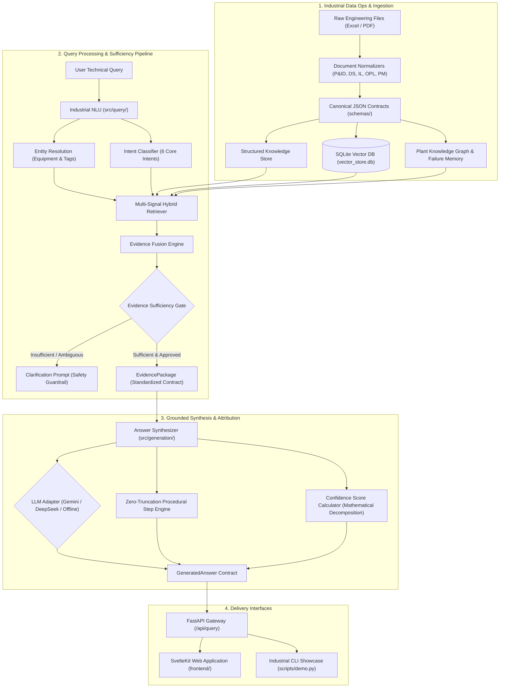
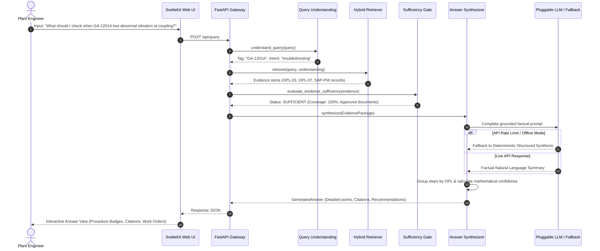
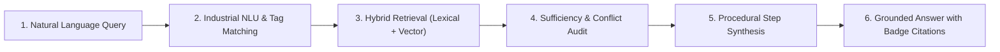

# Chandra Asri Pacific — Manufacturing Knowledge Hub
**CALIBER 2026 Competition — Case 1: AI-Powered Industrial Knowledge Integration**

[](https://www.python.org/downloads/)
[](https://fastapi.tiangolo.com)
[](https://svelte.dev)
[]()
[]()

An enterprise-grade, evidence-grounded industrial AI platform designed for continuous process petrochemical plants. It seamlessly connects **Equipment Datasheets, Piping & Instrumentation Diagrams (P&IDs), Interlock Cause & Effect Matrices, Standard Operating Procedures (SOPs), One-Point Lessons (OPLs), and Historical SAP PM Maintenance Logs** into an auditable, zero-hallucination knowledge hub that links every claim directly to verified engineering documents down to the page and revision.

---

## Table of Contents
1. [Industrial Context & Problem Statement](#industrial-context--problem-statement)
2. [System Architecture](#system-architecture)
3. [Architecture Diagrams](#architecture-diagrams)
4. [Query Pipeline Lifecycle](#query-pipeline-lifecycle)
5. [Core Engineering Capabilities](#core-engineering-capabilities)
6. [Mathematical Confidence Scoring Model](#mathematical-confidence-scoring-model)
7. [API Specifications & Core Endpoints](#api-specifications--core-endpoints)
8. [Installation & Getting Started](#installation--getting-started)
9. [Automated Test Suite & Adversarial Benchmarks](#automated-test-suite--adversarial-benchmarks)
10. [Repository Directory Structure](#repository-directory-structure)

---

## Industrial Context & Problem Statement

In continuous petrochemical operations, mission-critical engineering knowledge is typically fragmented across isolated silos:
* **Equipment Datasheets**: Static design boundaries, thermal ratings, and mechanical design pressures.
* **P&IDs (Piping & Instrumentation Diagrams)**: As-built piping configurations, battery limits, control loops, and tag designations.
* **Interlock Cause & Effect Matrices**: Safety Instrumented Systems (SIS/ESD), trip thresholds, and start permissives.
* **SOPs & One-Point Lessons (OPLs)**: Field operational checklists, troubleshooting steps, and SME tacit knowledge.
* **SAP PM (Plant Maintenance History)**: Empirical failure records, work orders, root cause analyses (RCAs), and corrective actions.

**Operational Risk:** When equipment anomalies emerge (e.g., pump coupling vibration or heat exchanger pressure drop), plant engineers and operators must cross-reference multiple siloed documents under time pressure. Reliance on memory, unverified assumptions, or fragmented documentation risks uncontained trips, catastrophic asset damage, and major safety hazards.

**Our Solution:** The **Manufacturing Knowledge Hub** establishes an **Industrial Data Ops** foundation that unifies all engineering modalities into canonical Pydantic data contracts, constructs a relational **Plant Knowledge Graph**, and orchestrates a **Multi-Signal Hybrid Retrieval Engine** governed by a strict **Evidence Sufficiency Gate** before generating verifiable, provenance-grounded answers.

---

## System Architecture

The platform is designed around a clean, decoupled 6-layer architecture:

```
┌─────────────────────────────────────────────────────────────────────────┐
│               PRESENTATION LAYER (Web UI & Industrial CLI)              │
│       SvelteKit 5 + Tailwind CSS (Web UI)  │  Terminal CLI Showcase     │
└────────────────────────────────────▲────────────────────────────────────┘
                                     │ HTTP REST / JSON
┌────────────────────────────────────▼────────────────────────────────────┐
│                    API GATEWAY (FastAPI Application)                    │
│      /api/query  │  /api/failure-memory/*  │  /api/graph/*  │  /health  │
└────────────────────────────────────▲────────────────────────────────────┘
                                     │
┌────────────────────────────────────┴────────────────────────────────────┐
│                    KNOWLEDGE ORCHESTRATION PIPELINE                     │
│                                                                         │
│  [1. Query Understanding]  ──► [2. Hybrid Retrieval Engine]             │
│   • Regex & Token Entity Res.   • Lexical Search (BM25 / Exact Match)   │
│   • Hybrid Intent Classifier    • SQLite Vector DB (Dense Embeddings)   │
│                                 • Dynamic Metadata Filtering            │
│                                                │                        │
│                                                ▼                        │
│  [4. Answer Synthesis & Grounding] ◄── [3. Evidence Sufficiency Gate]   │
│   • Pluggable LLM (Gemini/DeepSeek)• Provenance & Approval Check        │
│   • Zero-Truncation Step Engine • Obsolescence & Conflict Penalty       │
│   • Mathematical Confidence Calc• EvidencePackage Fusion                │
└────────────────────────────────────▲────────────────────────────────────┘
                                     │
┌────────────────────────────────────┴────────────────────────────────────┐
│              DATA STORAGE, GRAPH & FAILURE MEMORY LAYER                 │
│  • Canonical Structured Store (Datasheets, Interlocks, P&ID registers)  │
│  • In-Process SQLite Vector DB (TfidfDenseEmbedder, 900+ vectors)       │
│  • Plant Knowledge Graph (BFS Multi-Hop Failure Path Propagation)       │
│  • Active Failure Memory Engine (Symptom Matching & SAP PM RCA Records) │
└─────────────────────────────────────────────────────────────────────────┘
```

### The 6 Architectural Layers:

1. **Ingestion & Data Normalization Layer ([`src/ingestion/`](src/ingestion/)):**
   * Normalizes raw engineering spreadsheets and PDF documents into canonical Pydantic data models ([`schemas/`](schemas/)).
   * Validates document governance attributes (`Issued for Operation`, `Approved`, `Issued for Construction`).
2. **Plant Knowledge Graph & Failure Memory Layer ([`src/graph/`](src/graph/), [`src/failure_memory/`](src/failure_memory/)):**
   * Encodes physical plant hierarchy: `Plant -> Area -> Unit -> Equipment -> Instrument`.
   * Models multi-hop causal degradation pathways (e.g., *flush orifice obstruction $\rightarrow$ dry run $\rightarrow$ seal face overheating $\rightarrow$ high vibration trip*).
   * Failure Memory Engine tracks failure frequencies and performs symptom similarity matching against historical SAP PM work orders.
3. **Query Understanding & Industrial NLU ([`src/query/`](src/query/)):**
   * High-precision entity resolution for equipment tags (e.g., `GA-1201A`, `FA-8901`, `EA-5601`) and instrument loops (`PSLL-1201`, `VSHH-1201`).
   * Hybrid intent classification covering 6 distinct operational categories: `equipment_information`, `protection`, `troubleshooting`, `failure_history`, `operating_limits`, `conflict_check`.
4. **Multi-Signal Hybrid Retrieval Engine ([`src/retrieval/`](src/retrieval/)):**
   * Fuses exact keyword matching (BM25), subword character n-gram cosine matching, strict metadata filtering, and semantic vector similarity via an embedded SQLite vector store.
5. **Evidence Sufficiency Gate & Conflict Detector ([`src/retrieval/sufficiency.py`](src/retrieval/sufficiency.py)):**
   * Evaluates evidence sufficiency and document approval status before dispatching context to the generator.
   * Identifies contradictory process parameters across document revisions (triggering defensive warnings).
6. **Grounded Generation & Citation Attribution ([`src/generation/`](src/generation/)):**
   * Pluggable LLM adapters (Google Gemini 3.8 Flash, DeepSeek, OpenAI) with deterministic offline fallback.
   * **Zero-Truncation Procedural Step Engine**: Guarantees that diagnostic procedures from OPLs and SOPs are presented completely without arbitrary truncation.
   * Granular claim attribution mapping every point directly to an interactive source citation badge (`[DS1]`, `[IL2]`, `[OP7]`, `[PM5]`).

---

## Architecture Diagrams

### 1. High-Level Component & Data Flow Architecture



### 2. Query Execution Sequence Diagram



---

## Query Pipeline Lifecycle

Each technical query traverses a deterministic 6-stage lifecycle:



1. **Query Understanding (NLU):** Extracts targeted equipment tags (e.g., `GA-1201A`, `KC-4501`) and classifies engineering intent.
2. **Hybrid Retrieval:** Collects facts from datasheets, P&ID registers, interlock trip matrices, SME OPLs, and maintenance logs.
3. **Evidence Sufficiency Gate:** Validates that evidence originated from official documents with `Issued for Operation` or `Approved` status. For ambiguous queries lacking equipment tags, the system triggers a clarification prompt instead of speculating.
4. **Procedural Step Synthesis:**
   * Extracts every procedural step (`Step 1`, `Step 2`, ..., `Step N`) from OPLs without arbitrary limits.
   * Groups steps under their respective OPL procedure headings to ensure workflow integrity.
5. **Auditable Confidence Scoring:** Computes a mathematical composite score across asset match, source validity, sufficiency, and knowledge coverage.
6. **Delivery & Attribution:** Emits executive summaries, numbered procedural checklists, decoupled operational actions, and an interactive source citation table.

---

## Core Engineering Capabilities

### 1. Zero-Hallucination & Document Grounding
The system enforces strict provenance. If a parameter or value is absent from verified engineering documentation, the system explicitly reports that it is not specified rather than extrapolating.

### 2. Complete Procedural Step Preservation
In petrochemical maintenance, cutting an SOP or OPL procedure short is a severe safety hazard. The engine preserves all steps (from initial LOTO isolation down to final solo runs and guard reinstallation) grouped by procedure document.

### 3. Decoupled Operational Recommendations
Recommendations are strictly separated from factual claims. Actions are only proposed when backed by explicit OPL guidelines or validated historical SAP PM work orders, including defensive warnings against premature component replacement.

### 4. Failure Memory & SAP PM Mining
Connects field symptoms directly to historical work orders. The engine identifies previous root causes (e.g., grout fatigue, thermal growth misalignment) and provides proven corrective actions.

### 5. Multi-Hop Knowledge Graph Navigation
Enables traversing physical hierarchies and safety causal chains to explore how an upstream anomaly (e.g., level transmitter fault) propagates into downstream trips or equipment stress.

---

## Mathematical Confidence Scoring Model

Confidence levels (`HIGH`, `MEDIUM`, `LOW`, `UNVERIFIED`) are governed by an auditable mathematical formula:

$$\text{Confidence} = 0.25 \cdot A + 0.25 \cdot S + 0.25 \cdot R + 0.15 \cdot C + 0.10 \cdot I - P_{\text{conflict}} - P_{\text{obsolete}}$$

| Component | Weight | Measurement Objective |
| :--- | :---: | :--- |
| **Asset Match ($A$)** | **25%** | Entity resolution precision (`1.0` for exact tag match, `0.0` if ambiguous). |
| **Source Validity ($S$)** | **25%** | Ratio of approved engineering sources (`Approved` / `Issued for Operation`). |
| **Retrieval Sufficiency ($R$)** | **25%** | Verification that evidence satisfies the sufficiency gate criteria. |
| **Knowledge Coverage ($C$)** | **15%** | Fraction of required knowledge types fulfilled for the given intent. |
| **Intent Certainty ($I$)** | **10%** | Classification confidence of the query understanding engine. |
| **Conflict Penalty ($P_{\text{conflict}}$)** | *-30%* | Penalty deducted if contradictory engineering values are detected across revisions. |
| **Obsolete Penalty ($P_{\text{obsolete}}$)** | *-50%* | Penalty deducted if superseded or draft documents are cited. |

---

## API Specifications & Core Endpoints

The backend provides a high-performance REST API built on FastAPI:

| Endpoint | Method | Category | Description |
| :--- | :---: | :--- | :--- |
| **`/api/query`** | `POST` | **Core Q&A** | Answers technical, safety interlock, and troubleshooting queries with full citation provenance. |
| **`/api/failure-memory/search`** | `POST` | **Failure Memory** | Searches historical failure records and RCAs based on symptom descriptions. |
| **`/api/failure-memory/patterns/{tag}`** | `GET` | **Failure Memory** | Returns failure frequency distributions and recurring failure modes for an asset. |
| **`/api/failure-memory/rca/{tag}`** | `GET` | **Failure Memory** | Retrieves proven historical corrective actions and replacement parts from SAP PM. |
| **`/api/graph/hierarchy/{tag}`** | `GET` | **Plant Graph** | Traverses physical plant hierarchy (`Plant -> Area -> Unit -> Equipment`). |
| **`/api/graph/protections/{tag}`** | `GET` | **Plant Graph** | Maps interlock trip sensors, voting logic (2oo3/1oo2), and start permissives. |
| **`/api/graph/path`** | `POST` | **Plant Graph** | Traces multi-hop causal degradation and failure propagation pathways. |
| **`/api/health`** | `GET` | **Monitoring** | Service liveness probe. |
| **`/api/ready`** | `GET` | **Monitoring** | Readiness probe verifying vector store, graph engine, and document registry. |

---

## Installation & Getting Started

### 1. Environment Configuration (`.env`)
Copy the sample environment file:
```bash
cp .env.example .env
```

Configure your LLM provider in `.env`:
```env
# Option 1: Google Gemini (Recommended)
LLM_PROVIDER=gemini
GEMINI_API_KEY=AIzaSy...
GEMINI_MODEL=gemini-3.8-flash
LLM_TIMEOUT=18.0
OFFLINE_MODE=false

# Option 2: 100% Offline (Air-Gapped / No External API)
OFFLINE_MODE=true
```

---

### 2. Running with Docker Compose (Recommended)
Launch the complete stack (FastAPI backend + SvelteKit web frontend):

```bash
docker compose up --build -d
```
* **Web UI (Frontend)**: `http://localhost:3000`
* **API Documentation (Swagger UI)**: `http://localhost:8000/docs`

Check service logs:
```bash
docker compose logs -f
```

---

### 3. Local Development Setup

#### Backend (Python 3.11+):
```bash
# Create and activate virtual environment
python -m venv .venv
source .venv/bin/activate  # Linux/macOS
# .venv\Scripts\activate   # Windows

# Install dependencies
pip install -r requirements.txt

# Run the FastAPI server
python scripts/run_backend.py
```
*Backend runs at `http://127.0.0.1:8000`.*

#### Frontend (SvelteKit 5 + Node.js 20+):
```bash
cd frontend
npm install
npm run dev
```
*Frontend runs at `http://localhost:5173`.*

---

### 4. Running the Terminal CLI Showcase
To run automated competition demonstration queries directly in your terminal:
```bash
python scripts/demo.py --showcase
```

---

## Automated Test Suite & Adversarial Benchmarks

The project includes **99 automated unit, integration, and adversarial tests** covering:
* Hallucination resistance on non-existent specifications.
* Premature component replacement traps (advising root-cause verification first).
* Clarification triggers for ambiguous or missing equipment tags.
* Exact interlock trip thresholds and multi-document contradiction resolution.

Execute all tests with:
```bash
pytest -v
```

Verification status:
```text
============================= 99 passed in 2m 44s ==============================
```

---

## Repository Directory Structure

```text
manufacturing-knowledge-hub/
├── configs/                  # Routing configurations, retrieval weights, and confidence settings
│   ├── confidence_config.json
│   ├── plant_equipment_registry.json
│   └── retrieval_config.json
├── data/                     # Engineering knowledge store & plant documents
│   ├── extracted/            # Normalized JSON documents conforming to schemas
│   ├── knowledge/            # Plant physical hierarchy and causal graph definitions
│   ├── processed/            # Master canonical data (Datasheets, P&IDs, OPLs, SAP PM)
│   ├── raw/                  # Source spreadsheets and documents
│   └── vector_store.db       # In-process SQLite vector database (embeddings)
├── docs/                     # Technical specifications and architectural references
├── frontend/                 # SvelteKit 5 + Tailwind CSS Industrial Knowledge UI
│   ├── src/
│   │   ├── lib/              # UI components (AnswerView, DocumentList, ChatSidebar)
│   │   └── routes/           # Application views (Chat, Repository, Failure Memory)
│   ├── Dockerfile
│   └── package.json
├── schemas/                  # Pydantic Canonical Data Contracts
│   ├── common.py             # DocumentSource, DocumentStatus, EngineeringValue
│   ├── technical.py          # Datasheet, P&ID, Interlock data models
│   ├── maintenance.py        # SAP PM Maintenance Event data model
│   └── relationship.py       # Plant relationship matrix model
├── scripts/                  # CLI utilities & entrypoint runners
│   ├── demo.py               # Interactive CLI & automated competition showcase runner
│   └── run_backend.py        # Local backend server runner
├── src/                      # Core backend source modules
│   ├── adapters/             # Pluggable LLM adapters (Gemini, DeepSeek, OpenAI)
│   ├── api/                  # FastAPI web server & route handlers
│   ├── failure_memory/       # Failure memory engine & RCA mining
│   ├── generation/           # Evidence fusion, synthesizer, & confidence engine
│   ├── graph/                # Plant knowledge graph engine & pathfinder
│   ├── ingestion/            # Ingestion pipeline and document normalizers
│   ├── query/                # Industrial NLU & entity resolution engine
│   ├── retrieval/            # Multi-signal hybrid retriever & sufficiency gate
│   └── vector/               # SQLite in-process vector store & dense embedder
├── tests/                    # 99 Unit, integration, & adversarial test cases
├── Dockerfile                # Production-ready backend Dockerfile
├── docker-compose.yml        # Multi-container orchestration (Backend + Frontend)
└── requirements.txt          # Python dependencies
```

---

## Development Team (CALIBER 2026)
Developed for **CALIBER 2026 — Case 1: Manufacturing Knowledge Hub (Chandra Asri Pacific)**.  
Engineered to deliver modern industrial AI standards: **Accurate, Traceable, Anti-Hallucinatory, and Operationally Ready.**