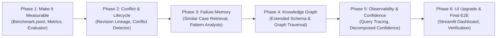

# Manufacturing Knowledge Hub — Next Development Planning
**Studi Kasus**: CALIBER 2026 Case 1 — PT Chandra Asri Pacific Tbk  
**Sistem**: AI-Powered Manufacturing Knowledge Hub with Traceable Hybrid RAG & Failure Memory  
**Status**: Approved Master Roadmap / Architecture Evolution  

---

## 1. Tujuan Planning
Planning ini disusun berdasarkan arsitektur Manufacturing Knowledge Hub yang saat ini sudah memiliki:
- Industrial Data Ops & Canonical Schemas
- Query Understanding & Entity Resolution
- Multi-Signal Hybrid Retrieval
- Evidence Sufficiency Gate
- Deterministic Factual Generation & Traceability
- Decoupled Operational Recommendations
- Streamlit / CLI / Enterprise Integration layer
- Failure Memory melalui MaintenanceRecord

Arsitektur saat ini sudah kuat pada sisi retrieval, evidence bounding, asset isolation, safe refusal, dan traceability. Fokus pengembangan berikutnya adalah membuat sistem lebih:
1. **Terukur (Measurable)**: Dibuktikan dengan benchmark kuantitatif formal dan metrik standar industri.
2. **Tahan terhadap konflik data (Conflict-Resilient)**: Mampu mendeteksi dan menyelesaikan kontradiksi antar dokumen resmi tanpa tebakan asal.
3. **Memahami lifecycle dokumen (Revision-Aware)**: Membedakan dokumen aktif (`Issued for Operation`) dari dokumen usang (`Superseded`/`Obsolete`).
4. **Berguna untuk historical failure analysis**: Mengembangkan memori kegagalan menjadi alat penelusuran pola kerusakan dan RCA.
5. **Aman untuk penggunaan multi-user**: Menyiapkan pondasi tata kelola dan verifikasi manusia (*Human-in-the-Loop*).
6. **Observable dan mudah diaudit**: Setiap tahapan memiliki trace, latency breakdown, dan `query_id`.
7. **Siap didemonstrasikan sebagai sistem industrial yang matang**.

---

## 2. Prioritas Pengembangan

### Priority 0 — Evaluation & Benchmark Framework
#### Masalah
Klaim performa (seperti 100% akurasi tag, 0% halusinasi, dan latensi rendah) harus didukung oleh benchmark formal dan dataset uji yang terstandarisasi serta dapat direproduksi kapan saja.

#### Tujuan
Membangun framework evaluasi modular yang mengukur performa setiap layer secara terpisah maupun end-to-end.

#### Dataset: `evaluation/benchmark.jsonl`
Mencakup kategori pengujian:
- **A. Asset Resolution**: Pengujian tag eksak (`GA-1201A`, `GA-1201B`), variasi nama ("pompa heksan", "feed pump A"), dan ketahanan terhadap tag yang mirip.
- **B. Intent Classification**: Pengujian 7 intensi teknik (`EQUIPMENT_INFORMATION`, `PROTECTION`, `TROUBLESHOOTING`, `FAILURE_HISTORY`, `LOCATION`, `PROCEDURE`, `GENERAL_INFORMATION`).
- **C. Retrieval**: Pengujian exact tag, partial tag, typo, alias, natural language, kueri dwibahasa (ID/EN), dan kueri numerik.
- **D. Safety / Sufficiency**: Pengujian bukti cukup, bukti tidak cukup, asset mismatch, kueri ambigu, dan sumber obsolete.
- **E. Numeric Accuracy**: Memastikan nilai dan satuan parameter teknik (flow, head, pressure, vibration setpoints) tidak terdistorsi atau terkonversi salah.
- **F. Citation Accuracy**: Memastikan setiap klaim terikat pada `document_id`, `revision`, `status`, `page`, dan `evidence_id`.

#### Metrik Kunci
- `Asset Resolution Accuracy`
- `Intent Accuracy`
- `Recall@K`, `Precision@K`, `MRR`
- `Sufficiency Classification Accuracy`
- `Safe Refusal Accuracy`
- `Citation Accuracy`
- `Numeric Accuracy`
- `Unsupported Claim Rate`
- `End-to-End Latency`

---

### Priority 1 — Document Lifecycle & Revision Management
#### Masalah
Sistem perlu memahami hubungan silsilah revisi (*revision lineage*) dan status siklus hidup dokumen. Dokumen yang telah digantikan (`SUPERSEDED`) atau usang (`OBSOLETE`) tidak boleh menjadi bukti operasional aktif secara diam-diam.

#### Perluasan Metadata
- `effective_date`, `approval_date`, `expiry_date`
- `supersedes`, `superseded_by`
- Status siklus hidup: `DRAFT`, `UNDER_REVIEW`, `APPROVED`, `ISSUED_FOR_OPERATION`, `SUPERSEDED`, `OBSOLETE`.

#### Aturan Retrieval
Jika terdapat `Rev 01 (SUPERSEDED)` dan `Rev 02 (ISSUED_FOR_OPERATION)`, retrieval wajib memilih `Rev 02`. Jika hanya ada dokumen usang, sistem memberikan peringatan eksplisit.

---

### Priority 1 — Conflict Detection & Resolution
#### Masalah
Jika dua sumber resmi menyajikan data berbeda (misal: Interlock Rev.03 menyatakan $PSLL = 0.8\text{ barg}$, sedangkan OPL Rev.02 menyatakan $PSLL = 0.75\text{ barg}$), sistem tidak boleh memaksakan memilih salah satu secara spekulatif.

#### Solusi
Alur deteksi konflik:
$$\text{Conflict Detector} \longrightarrow \text{Source Authority Ranking} \longrightarrow \text{Revision Comparison} \longrightarrow \text{Conflict Status} \longrightarrow \text{Safe Response}$$

Jenis konflik: `NUMERIC_CONFLICT`, `REVISION_CONFLICT`, `STATUS_CONFLICT`, `PROCEDURE_CONFLICT`, `ASSET_CONFLICT`.  
Output: `CONFLICTING_EVIDENCE` disertai pemaparan kedua sumber dan ajakan verifikasi terhadap dokumen operasi aktif terbaru.

---

### Priority 2 — Strengthen Failure Memory
#### Tujuan
Mengubah `MaintenanceRecord` dari sekadar pencatatan pasif menjadi sistem memori kegagalan aktif untuk analisis pola kerusakan dan bantuan RCA tanpa berubah menjadi diagnosis otomatis.

#### Fitur Penelusuran
- **Historical lookup**: Penelusuran riwayat insiden spesifik.
- **Pattern lookup**: Frekuensi mode kegagalan terbanyak pada peralatan tertentu.
- **Root-cause & Corrective-action lookup**: Mengetahui akar masalah dan solusi yang terbukti efektif di masa lalu.
- **Similar-case lookup**: Menemukan insiden terdahulu yang memiliki gejala (*symptoms*) serupa.
- **Prinsip**: $\text{Historical evidence} \neq \text{Current diagnosis}$.

---

### Priority 2 — Expand Knowledge Graph
Memperluas relasi pada `RelationshipRecord` untuk mencakup hierarki pabrik menyeluruh:
$$\text{Plant} \to \text{Area} \to \text{Unit} \to \text{Equipment} \to \text{Component} \to \text{Instrument} \to \text{Protection} \to \text{Failure Mode} \to \text{Action}$$

Relasi standar: `LOCATED_IN`, `PART_OF`, `CONNECTED_TO`, `MEASURES`, `PROTECTED_BY`, `TRIPPED_BY`, `PERMISSIVE_START`, `HAS_FAILURE_MODE`, `HAS_HISTORY`, `CAUSES`, `DEPENDS_ON`, `SUPERSEDES`.

---

### Priority 2 — Evidence Confidence Decomposition & Observability
- **Dekomposisi Confidence**: Memberikan transparansi matematis di balik lencana confidence:
  $$\text{Confidence} = f(\text{Asset}, \text{Intent}, \text{Retrieval}, \text{Source Validity}, \text{Coverage}) - \text{Conflict Penalty}$$
- **Query Tracing & Observability**: Pemberian `query_id` unik pada setiap transaksi untuk merekam latensi tiap tahapan pipeline dan rekam jejak audit (*audit trail*).
- **Human-in-the-Loop Feedback**: Penyediaan antarmuka bagi engineer untuk memvalidasi bukti (`verified`, `incorrect`, `needs review`).

---

### Priority 3 — Enhanced UI & Testing Pyramid
- **Peningkatan Dashboard Streamlit**:
  - Panel status peralatan dan ringkasan proteksi aktif.
  - Spanduk peringatan konflik (*Conflict Banner*).
  - Panel interaktif riwayat kegagalan dan penelusuran kasus serupa.
  - Penjelasan visual alasan tingkat keyakinan (*Confidence Explanation*).
- **Testing Pyramid 4 Tingkat**:
  1. *Level 1 — Unit Test*: Pengujian komponen modular terisolasi.
  2. *Level 2 — Integration Test*: Pengujian integrasi antar layer.
  3. *Level 3 — Safety Test*: Uji kasus adversarial, kontradiksi, dan penolakan aman.
  4. *Level 4 — E2E Benchmark*: Pengukuran performa menyeluruh menggunakan `benchmark.jsonl`.

---

## 3. Tahapan Eksekusi Bertahap (Development Roadmap)

### Status Pelaksanaan: SEMUA TAHAP SELESAI (100% Verified)
- [x] **Phase 1: Make It Measurable**: `benchmark.jsonl`, `metrics.py`, `evaluator.py`, `baseline_report.json` (100% Tag & Intent Accuracy, 0% Hallucination, 6.6 ms Latency).
- [x] **Phase 2: Conflict & Lifecycle**: `ConflictDetector`, `ConflictRecord`, `DocumentLifecycleRecord`, dan respon transparan komparatif.
- [x] **Phase 3: Active Failure Memory**: `FailureMemoryAnalyzer`, pattern aggregation, symptom matching, dan penegakan prinsip $\text{Historical evidence} \neq \text{Current diagnosis}$.
- [x] **Phase 4: Plant Knowledge Graph**: `PlantKnowledgeGraph`, 12+ predikat, penelusuran hierarki pabrik, dan BFS multi-hop causal degradation path.
- [x] **Phase 5: Observability & Confidence**: Dekomposisi 5 pilar confidence matematis, `QueryTracer`, tracking latensi bertahap, dan pencatatan jejak audit.
- [x] **Phase 6: UI Upgrade & E2E Verification**: Dashboard Streamlit 4 tab (`app.py`), Conflict Banner, Failure Memory explorer, dan testing pyramid 80/80 passed.

