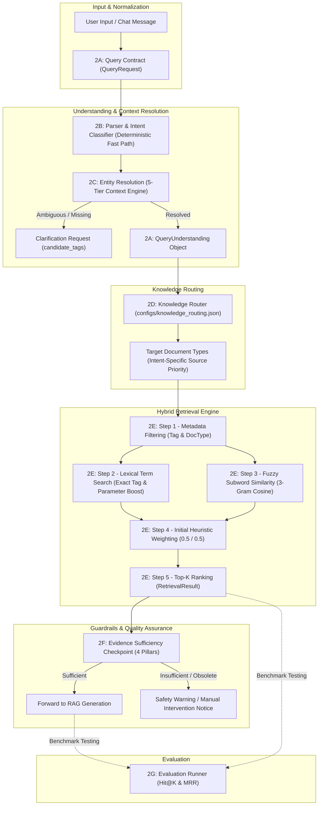

# Phase 2 Technical Architecture: Agentic Query Understanding & Hybrid Retrieval (2A — 2G)

Dokumen ini mendokumentasikan arsitektur, spesifikasi kontrak, serta mekanisme kerja mendalam dari setiap sub-phase (2A hingga 2G) pada modul pemrosesan query dan temu balik bukti (*evidence retrieval*) untuk **Manufacturing Knowledge Hub (CALIBER 2026 - Case 1)**.

---

## 1. Prinsip Arsitektur Industri (Design Philosophy)

1. **Deterministic Fast Path + Fallback**:
   Untuk sistem industri petrokimia yang *safety-critical*, determinisme adalah keunggulan utama. Pertanyaan dengan pola teknis jelas (`"Does GA-1201A trip on high vibration?"`) diproses melalui *Deterministic Fast Path* ($< 0.1\text{ ms}$, zero-cost, zero-hallucination). Model LLM diposisikan sebagai *fallback layer* untuk menangani kalimat yang *unresolved / low-confidence*.
2. **Intent-Specific Source Priority**:
   Tidak ada ranking dokumen universal. Prioritas dokumen bergantung pada kebutuhan informasi pengguna (*the user's information need*):
   * *Troubleshooting* $\longrightarrow$ OPL & Interlock diprioritaskan.
   * *Equipment Information* $\longrightarrow$ Datasheet & GA Drawing diprioritaskan.
   * *Failure History* $\longrightarrow$ Maintenance Record diprioritaskan.
3. **Pemisahan Pengetahuan vs Dokumen**:
   `KnowledgeType` (kebutuhan informasi: *operating_procedure*, *protection_logic*) dipisahkan secara tegas dari `DocumentType` (file fisik: *OPL*, *INTERLOCK*). Knowledge Router yang bertugas menjembatani keduanya.
4. **Calibrate First, Specialize Second**:
   Batas ambang kelayakan bukti (*sufficiency threshold*) didasarkan pada kalibrasi empiris distribusi skor terhadap dataset benchmark, bukan angka tebakan sepihak.

---

## 2. Alur Kerja Menyeluruh (End-to-End Pipeline)

---

## 3. Rincian & Mekanisme per Sub-Phase

### Sub-Phase 2A — Query Contract
* **`QueryRequest`**: Memuat `query`, `equipment_tag` opsional, dan `session_context`.
* **`ResolutionMetadata`**: Menyimpan `source: ResolutionSource` (`explicit_query`, `ui_context`, `conversation_context`, `inferred`, `none`), `confidence: ResolutionConfidence` (`high`, `medium`, `low`, `none`), dan `candidate_tags`.
* **`QueryUnderstanding`**: Menampung `intent`, `equipment_tag`, `entities`, dan murni `knowledge_types` (bukan document types).

### Sub-Phase 2B — Query Understanding (Deterministic Fast Path)
* **Plant Equipment Registry**: 8 unit baseline Chandra Asri (`GA-1201A` s.d. `FA-8901`) beserta nama alias lapangan (*"hexane feed pump"*, *"polymer dryer"*).
* **Pemisahan Instrumen**: Tag sensor/switch transmitter (`VSHH-1201`, `PSLL-1201`) dipisahkan ke `entities["instrument_tags"]`.
* **Intent Classifier**: Rule-based deterministik untuk 7 kategori operasional (*equipment_information, procedure, troubleshooting, failure_history, protection, location, general_information*).

### Sub-Phase 2C — Contextual Entity Resolution
Hierarki 5 tier resolusi aset:
1. **Tier 1 (Explicit Query)**: Tag atau alias langsung pada teks (Confidence: `HIGH`). Jika multitarget $\rightarrow$ `candidate_tags` + klarifikasi.
2. **Tier 2 (UI Context)**: Dari state UI aktif (`ui_selected_tag` / `current_equipment`) (Confidence: `HIGH`).
3. **Tier 3 (Conversation History)**: Menelusuri riwayat dialog ke belakang (*backward traversal*) untuk menemukan tag terakhir yang dibahas (Confidence: `HIGH`).
4. **Tier 4 (Category Inference)**: Pertanyaan umum (*"cek pompa"*) dipetakan ke unit tunggal (`GA-1201A`) dengan Confidence `MEDIUM` dan Source `inferred`.
5. **Tier 5 (Clarification Fallback)**: Tidak ada konteks $\rightarrow$ Source `none`, `requires_clarification: True`.

### Sub-Phase 2D — Intent-Specific Knowledge Routing
Pemetaan dinamis dari [configs/knowledge_routing.json](file:///C:/Users/AryoBama/Lomba/CALIBER/manufacturing-knowledge-hub/configs/knowledge_routing.json):
* `troubleshooting` $\longrightarrow$ `["OPL", "INTERLOCK", "MAINTENANCE", "PID"]`
* `protection` $\longrightarrow$ `["INTERLOCK", "PID"]`
* `failure_history` $\longrightarrow$ `["MAINTENANCE"]`
* `procedure` $\longrightarrow$ `["OPL", "SOP"]`
* `equipment_information` $\longrightarrow$ `["DATASHEET", "GA_DRAWING"]`
* `location` $\longrightarrow$ `["PLOT_PLAN", "GA_DRAWING"]`

### Sub-Phase 2E — Hybrid Retrieval Engine
* **Step 1 (Metadata Filtering)**: Filter deterministik berbasis `equipment_tag` dan prioritas dokumen hasil routing.
* **Step 2 (Lexical Search)**: Pencarian istilah eksak + boost tag alat ($+0.30$) dan parameter kritis ($+0.05$).
* **Step 3 (Character-Level Fuzzy / Subword Similarity)**: Menggunakan cosine similarity character 3-gram tanpa dependensi berat untuk mencocokkan variasi kata (*vibrates* $\leftrightarrow$ *vibration*).
* **Step 4 (Initial Heuristic Weighting)**: Kombinasi skor $0.5 \times \text{Lexical} + 0.5 \times \text{Fuzzy Subword}$.
* **Step 5 (Ranking)**: Mengurutkan kandidat dan mengambil top-$K$.

### Sub-Phase 2F — Evidence Sufficiency Checkpoint
Evaluasi 4 pilar sebelum RAG:
1. **Relevance**: Skor relevansi teratas $\ge 0.20$.
2. **Source Validity**: Mengeliminasi dokumen berstatus `Draft` atau `Obsolete`.
3. **Asset Match**: Memvalidasi kepatuhan bukti terhadap tag alat target.
4. **Knowledge Coverage**: Melacak `covered_knowledge_types` vs `uncovered_knowledge_types`.
Status: `SUFFICIENT`, `INSUFFICIENT`, `CLARIFICATION_REQUIRED`.

### Sub-Phase 2G — Benchmark Evaluation
Hasil evaluasi empiris pada [evaluation/retrieval_questions.json](file:///C:/Users/AryoBama/Lomba/CALIBER/manufacturing-knowledge-hub/evaluation/retrieval_questions.json):
* **Hit@1**: $100.0\%$ ($6/6$)
* **Hit@3**: $100.0\%$ ($6/6$)
* **Hit@5**: $100.0\%$ ($6/6$)
* **MRR**: $1.000$ (Seluruh target bukti berada di peringkat #1)
* **Sufficiency Accuracy**: $100.0\%$ ($7/7$)

---

## 4. Engineering Maturity Audit (Defensible Architecture)

| Komponen | Status | Catatan Arsitektur |
|---|:---:|---|
| **Equipment Registry** | 🟢 | Penyederhanaan prototipe yang tepat untuk baseline 8 alat; extensible dari AIMS/SAP PM pada tahap integrasi. |
| **Alias Recognition** | 🟢 | Efektif memetakan bahasa teknisi ke kode tag resmi pabrik. |
| **Symptom Keywords** | 🟡 | Heuristik awal yang memadai; akan diperkaya melalui riwayat insiden maintenance. |
| **Rule-Based Intent** | 🟢 | *Deterministic Fast Path* ($< 0.1\text{ ms}$, zero-hallucination). LLM diposisikan sebagai fallback untuk kueri tak terselesaikan. |
| **Knowledge Routing Table** | 🟢 | Konfigurasi eksternal terpisah dari kode sumber. |
| **Intent-Specific Priority** | 🟢 | Menghilangkan bobot universal; prioritas dokumen ditentukan oleh kebutuhan informasi pengguna. |
| **Fuzzy Subword Similarity** | 🟢 | Baseline ringan tanpa vektor embedding eksternal; tangguh terhadap variasi morfologi kata. |
| **Heuristic Weighting (0.5/0.5)** | 🟡 | Pembobotan awal; dapat disesuaikan lebih lanjut via kalibrasi benchmark. |
| **Sufficiency Threshold** | 🟡 | Ambang batas $0.20$ tervalidasi pada benchmark saat ini; prinsip: *calibrate first, specialize second*. |
| **Fallback Config di Kode** | 🟢 | *Defensive programming* standar untuk menjaga sistem tidak crash jika file konfigurasi eksternal hilang. |
